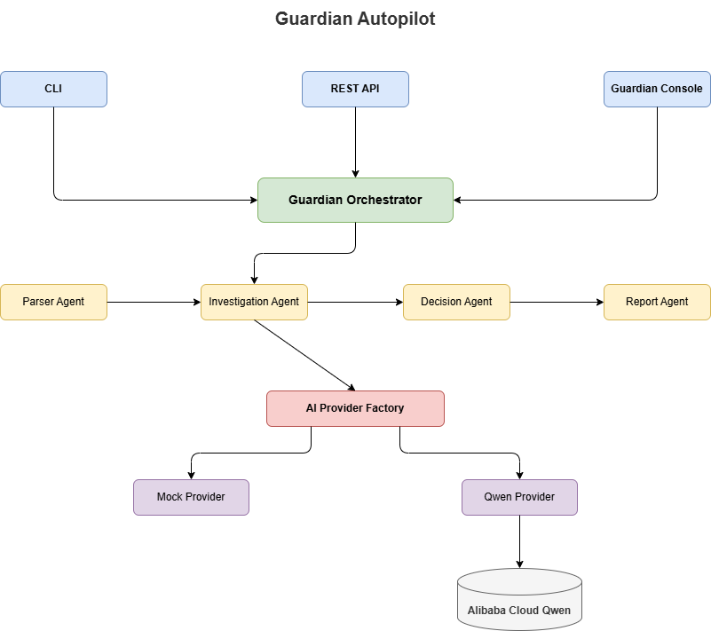
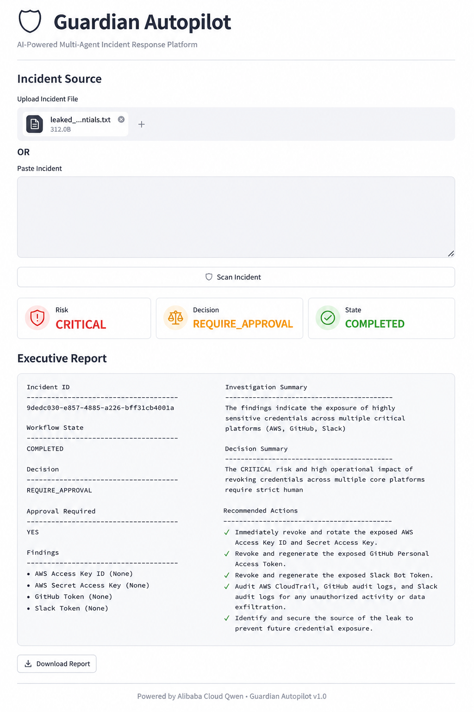
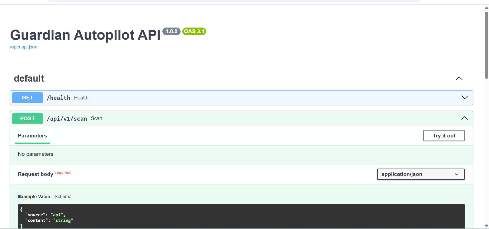
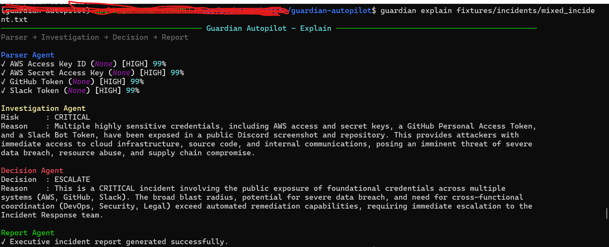

# 🛡 Guardian Autopilot

### AI-Powered Multi-Agent Incident Response Platform

**Built with Alibaba Cloud Qwen** • **An Open Source Project by Gotihub**

Guardian Autopilot is an AI-powered multi-agent incident response platform that detects exposed credentials, investigates security incidents, evaluates operational risk, and generates executive incident reports using Alibaba Cloud Qwen.

Developers can interact with Guardian through a powerful CLI, REST API, or the Guardian Console, making it suitable for local development, cloud deployment, and production-ready security workflows.

---

# Architecture



---

# Guardian Console



---

# REST API



---

# Developer CLI



---

# Features

- Multi-Agent Security Workflow
- Alibaba Cloud Qwen Integration
- Guardian Orchestrator
- Parser Agent
- Investigation Agent
- Decision Agent
- Report Agent
- Provider Abstraction
- Developer CLI
- REST API (FastAPI)
- Guardian Console (Streamlit)
- Executive Incident Reports
- Docker Deployment
- Alibaba Cloud Ready
- Open Source

---

# 🏆 Why Guardian Autopilot?

Guardian Autopilot demonstrates a complete AI-powered incident response workflow:

- Detects exposed credentials from text or screenshots
- Performs AI-assisted security investigation
- Evaluates operational risk
- Determines remediation strategy
- Produces executive-ready incident reports
- Supports CLI, REST API, and a web-based Guardian Console
- Powered by Alibaba Cloud Qwen through a provider abstraction layer

---

# Project Architecture

```
                  🛡️ Guardian Autopilot

        CLI         REST API         Guardian Console
         │              │                    │
         └──────────────┼────────────────────┘
                        │
                        ▼
              Guardian Orchestrator
                        │
      ┌─────────────────┼─────────────────┐
      ▼                 ▼                 ▼
 Parser Agent   Investigation Agent   Decision Agent
                        │
                        ▼
                  Report Agent
                        │
                        ▼
               AI Provider Factory
                ┌─────────┴─────────┐
                ▼                   ▼
         Mock Provider       Qwen Provider
                                     │
                                     ▼
                       Alibaba Cloud Qwen

```

---

# Quick Start

```bash
git clone https://github.com/apurba-labs/guardian-autopilot.git

cd guardian-autopilot

uv sync

cp .env.example .env
```

Configure

```
DASHSCOPE_API_KEY=your_api_key
```

---

# CLI

```bash
guardian doctor

guardian explain fixtures/incidents/mixed_incident.txt

guardian serve
```

---

# REST API

```bash
guardian serve
```

Swagger

```
http://localhost:8000/docs
```

---

# Guardian Console

```bash
streamlit run src/ui/app.py
```

Open

```
http://localhost:8501
```

---

# Docker

Build

```bash
docker compose build
```

Run

```bash
docker compose up -d
```

API

```
http://localhost:8000/docs
```

Console

```
http://localhost:8501
```

---

# 🧪 Verification & Testing

Run the following commands to verify that Guardian Autopilot is working correctly.

### Environment

```bash
guardian doctor
```

### Version

```bash
guardian version
```

### End-to-End Workflow

```bash
guardian explain fixtures/incidents/mixed_incident.txt
```

### Individual Agent Tests

Parser Agent

```bash
uv run python -m tests.integration.test_parser
```

Investigation Agent

```bash
uv run python -m tests.integration.test_investigation
```

Decision Agent

```bash
uv run python -m tests.integration.test_decision
```

Report Agent

```bash
uv run python -m tests.integration.test_report
```

Guardian Orchestrator

```bash
uv run python -m tests.integration.test_orchestrator
```

Alibaba Cloud Qwen Connectivity

```bash
uv run python -m tests.integration.test_alibaba_connection
```

### REST API

Start the API:

```bash
guardian serve
```

Open Swagger:

```
http://localhost:8000/docs
```

### Guardian Console

```bash
streamlit run src/ui/app.py
```

Open:

```
http://localhost:8501
```

---

# Alibaba Cloud Deployment

Guardian Autopilot is designed for Alibaba Cloud.

Deployment options include:

- Alibaba Cloud ECS
- Docker Compose
- Simple Application Server (SAS)

The project integrates directly with Alibaba Cloud Qwen using the OpenAI-compatible API.

---

# Technology Stack

- Python 3.12
- Alibaba Cloud Qwen
- FastAPI
- Streamlit
- Typer
- Rich
- Docker
- uv

---

# Roadmap

## v1.0

- ✅ Multi-Agent Workflow
- ✅ Guardian CLI
- ✅ REST API
- ✅ Guardian Console
- ✅ Alibaba Cloud Qwen
- ✅ Docker Deployment

## v1.1

- PDF Report Export
- React Dashboard
- GitHub Actions
- PyPI Package
- Docker Hub
- Kubernetes Deployment

---

# Contributing

Contributions are welcome.

Please open an Issue or Pull Request.

---

# License

MIT License